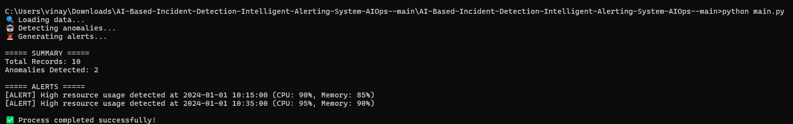

# 🔥 AI-Based Incident Detection & Alerting System (AIOps)

## 📌 Overview
This project demonstrates an AIOps (Artificial Intelligence for IT Operations) solution for detecting anomalies in system metrics such as CPU and memory usage.

It helps DevOps teams proactively identify infrastructure issues and reduce incident response time using Machine Learning.

---

## 🚀 Features
- ✅ Anomaly detection using Machine Learning (Isolation Forest)
- ✅ Automated alert generation for abnormal system behavior
- ✅ Simple and scalable architecture
- ✅ Real-world DevOps monitoring use case

---

## 🧠 AIOps Concept
This project applies AIOps principles:
- Intelligent monitoring  
- Anomaly detection  
- Predictive alerting  
- Reduced manual intervention  

---

## 🛠 Tech Stack
- Python
- Pandas
- Scikit-learn
- Matplotlib

---

## 📊 Input Data
The system uses metrics like:
- CPU Usage
- Memory Usage

---

## ▶️ How It Works
1. Load system metrics data
2. Detect anomalies using ML model
3. Generate alerts for abnormal behavior
4. Display results

---

## ⚙️ Run the Project

```bash
# Install project dependencies
python -m pip install --upgrade pip
python -m pip install -r requirements.txt

# Run the application
python main.py
```

## 📸 Project Output

Below is a sample output of the system:



## ✅ Sample Output

🔍 Loading data...
🤖 Detecting anomalies...
🚨 Generating alerts...

===== SUMMARY =====
Total Records: 10
Anomalies Detected: 2

===== ALERTS =====
[ALERT] High resource usage detected at 2024-01-01 10:15:00 (CPU: 90%, Memory: 85%)
[ALERT] High resource usage detected at 2024-01-01 10:35:00 (CPU: 95%, Memory: 90%)

✅ Process completed successfully!

This output demonstrates anomaly detection using AIOps principles.
